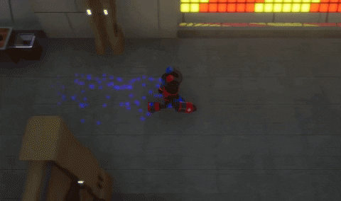

## Brave Magnet

<iframe class="youtube" src="https://www.youtube-nocookie.com/embed/skywlWLq6pc" title="YouTube video player" frameborder="0" allowfullscreen></iframe>

 This game was made as part of a collaboration between Rochester Institute of Technology and Kyoto Computer Gakuin in Japan, for Global Game Jam 2022. Our team was comprised of 3 American RIT students, and 4 Japanese KCG students.

{: .img-left}
For this project, I used Niagara to create particles that indicate the player's current magnetic polarity - blue repels blue enemies, and red repels red enemies. 

This project was also an amazing opportunity for me to challenge and grow not only my budding Japanese ability, but also my overall communication skills and confidence. As I was the team member most capable in both languages, it fell on me to ensure that everyone was on the same page and keep discussions moving. Since the Japanese members of our team were also new to git, it was also my job to help them out with it. 

