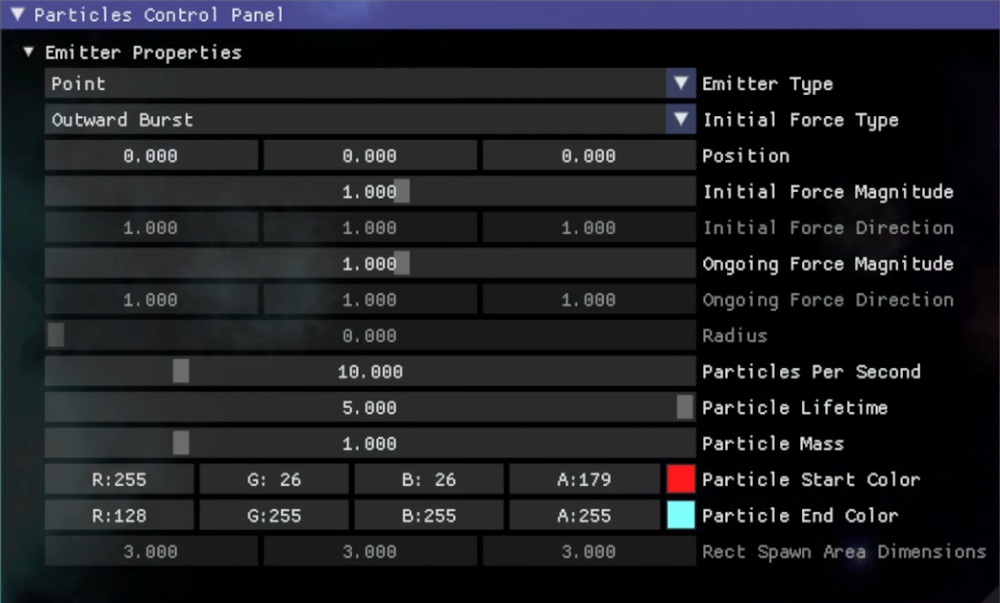

Changing particles emitted per second

This is a simple particle system that allows the user to edit some of its parameters through a user interface (pictured below).

This particle system is built off of an existing DirectX 11 project, which was originally given as barebones starter code for my graphics programming class. I continue to use this and another version as a sandbox framework to explore and experiment with different parts of graphics programming.

Dear ImGui is the UI library used for this project. 

Changing colors - the particle colors shift between a start and end color, which the user can set

Changing the shape that the particles are spawned within - the user can also alter its' dimensions

Changing the mass used in the physics calculation of the particles' movement
