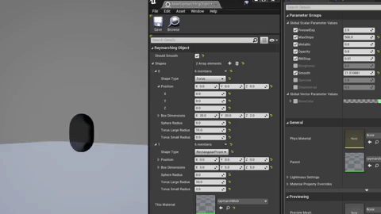

In this project, I wanted to create a tool in Unreal Engine that would make raymarching visuals accessible to artists that don't have experience with shader programming. 

Working on this project involved a lot of trial and error, as I was new to both raymarching and Unreal plugins. It was a wildly challenging experience of learning how to seek out and piece together answers from limited information. I often found that the source code of Unreal Engine itself was the place to go for answers, or at least to point myself in the right direction when searching online. After much effort I managed to hook up a UI to a custom asset, which automatically updates the underlying shader when it's changed.

Currently, this tool allows the user to add sphere, torus, and rectangular prism shape primitives. Then, because these shapes are defined by math rather than polygons, they can be smoothed together with a lerp function.

## What is raymarching?

 Simply put, raymarching is a rendering technique where elements in the scene are defined by mathematical formulas rather than with traditional 3D models. This opens the door for some really interesting and unique effects.

